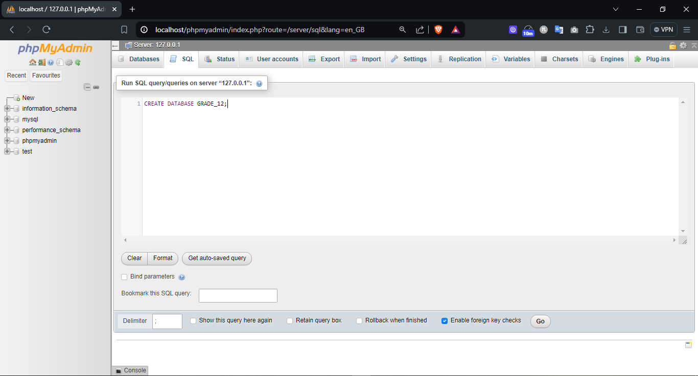

---

# Practice SQL Coding

We were assigned a task to try out some `SQL` keywords by launching a local host XAMPP server with phpMyAdmin.

To fulfill the task, I first downloaded the XAMPP control panel software on my laptop and launched the local host server hosted at `https://localhost/phpmyadmin`. Then, through it, the following `SQL` keywords were run to understand them.

### SQL Keywords:
1. **CREATE**
2. **DROP**
3. **ALTER**
4. **ADD**
5. **UPDATE**
6. **SET**
7. **INSERT**
8. **SELECT**

---

### Implementation

**Step 1: Creating a Database Named `GRADE_12`**

**Inside the Database:**

**Step 2: Creating a Table Named `Section_g`**

Navigate inside the database to the `SQL Query` tab to create a table named **Section_g**.

**Database After Creating Tables:**

**Step 3: Adding a New Column Named `AGE`**

To understand modifying table data, I added a new column named `AGE`.

**After Adding the Age Column:**

**Step 4: Dropping the `AGE` Column**

To understand the deleting mechanism, the newly created `AGE` column was then dropped.

**Table After Dropping Age Column:**

**Step 5: Dropping the Table `Section_g`**

Navigate to the SQL tab of the database `GRADE_12` to drop the table `Section_g`.

**Database After Dropping the Table `Section_g`:**

**Step 6: Dropping the Database `GRADE_12`**

Navigate to the server SQL tab to drop the newly created database.

**Server After Dropping Database `GRADE_12`:**

---

