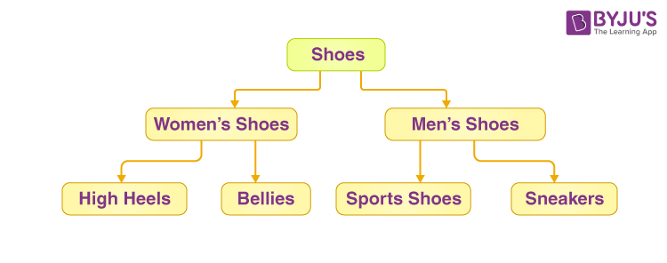
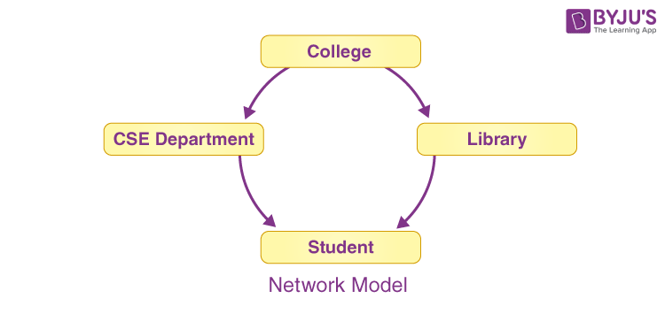
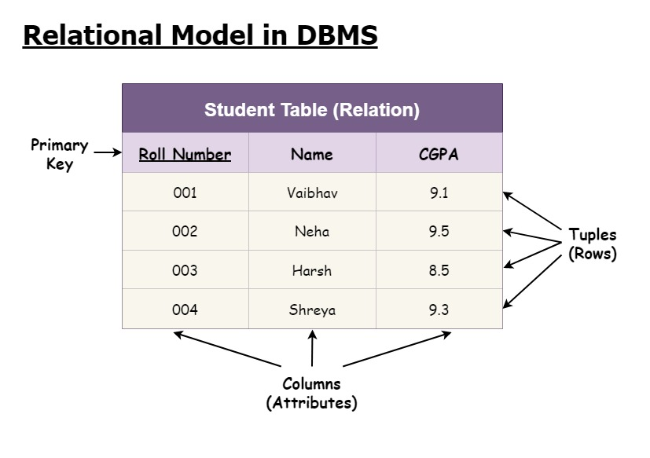
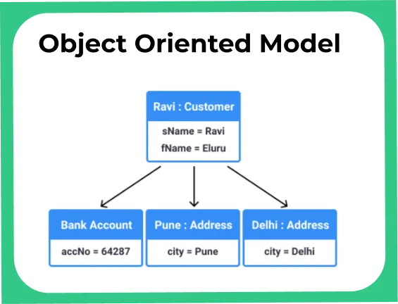

# Database Models and Relations in SQL

## Introduction
Databases are structured around different models, each offering unique approaches to data organization and management. This site reflects on the concept of these models and their corresponding relationships, based on what we have covered in class.

## Database Models
- **Hierarchical Model**
  The Hierarchical Model organizes data in a tree-like structure, where each child record has a single parent. This model is straightforward and easy to understand, making it suitable for simple, well-defined relationships. However, its rigidity can be a limitation, as it does not easily accommodate complex relationships or changes in the data structure.

- **Network Model**
  The Network Model enhances flexibility compared to the Hierarchical Model by allowing many-to-many relationships. This model uses a graph structure to connect multiple records, making it more adaptable for complex relationships where multiple entities are interconnected. This flexibility, however, can introduce complexity in navigating and managing data.

- **Relational Model**
  The Relational Model stores data in tables, also known as relations, which consist of rows and columns. It employs SQL (Structured Query Language) for data manipulation and querying. This model is widely used due to its simplicity and power, offering robust mechanisms for organizing, retrieving, and managing data through well-defined relationships between tables.

- **Object-Oriented Model**
  The Object-Oriented Model integrates principles from object-oriented programming, representing data as objects. This approach allows for a closer alignment with real-world entities and behaviors, making it easier to model complex systems. Data is encapsulated within objects, which can include both data attributes and methods, facilitating more dynamic and flexible data management.

  

---
## Types of Relationships
- **One-to-One**
  In a One-to-One relationship, each record in one table is linked to a single record in another table, and vice versa. This type of relationship is less common but useful for cases where data needs to be split into separate tables, such as a table for user profiles and a table for user addresses.

- **One-to-Many**
  A One-to-Many relationship occurs when a single entity in a table is associated with multiple records in another table. This is the most common type of relationship, where, for example, one user can place many orders. This relationship allows for efficient data organization and retrieval, as the single record in the primary table can relate to multiple records in the related table.

- **Many-to-Many**
  In a Many-to-Many relationship, multiple records in one table are related to multiple records in another table. This type of relationship is managed through a junction or pivot table, which holds the associations between the records. For instance, a student can enroll in many courses, and each course can have many students enrolled. The junction table facilitates the management of these complex interconnections.
---

